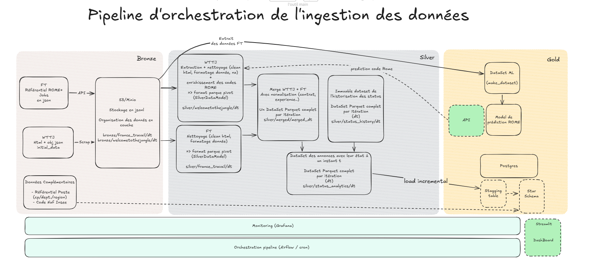
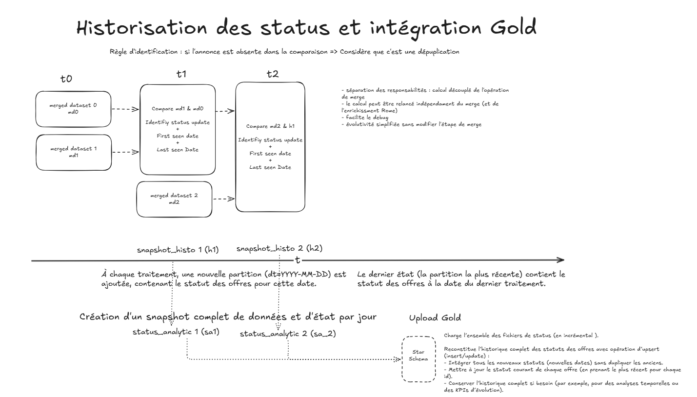

# Job Market - Plateforme d'analyse du marché du travail en France

**Job Market** est une plateforme complète d'ingestion, d'enrichissement et de restitution des offres d'emploi françaises. Elle collecte les données depuis plusieurs sources, les enrichit par classification automatique, les stocke dans une architecture médaillon, et les expose via un tableau de bord analytique interactif.

---

## Table des matières

1. [Vue d'ensemble](#1-vue-densemble)
2. [Architecture générale](#2-architecture-générale)
3. [Infrastructure Docker](#3-infrastructure-docker)
4. [Pipeline de données](#4-pipeline-de-données)
5. [API FastAPI](#5-api-fastapi)
6. [Modèle ML - Classification ROME](#6-modèle-ml--classification-rome)
7. [Tableau de bord Streamlit](#7-tableau-de-bord-streamlit)
8. [Orchestration Airflow](#8-orchestration-airflow)
9. [Base de données PostgreSQL](#9-base-de-données-postgresql)
10. [Stockage objet MinIO](#10-stockage-objet-minio)
11. [Monitoring & Observabilité](#11-monitoring--observabilité)
12. [Sécurité réseau](#12-sécurité-réseau)
13. [CI/CD](#13-cicd)
14. [Tests](#14-tests)
15. [Backup & Restore](#15-backup--restore)
16. [Configuration](#16-configuration)
17. [Démarrage rapide](#17-démarrage-rapide)
18. [Déploiement production](#18-déploiement-production)

---

## 1. Vue d'ensemble

### Sources de données

| Source | Méthode | Volume estimé | Format brut |
|---|---|---|---|
| **France Travail** | API REST OAuth2 officielle | ~100 000 offres/cycle | JSONL partitionné |
| **Welcome to the Jungle** | Web scraping (sitemap + HTML) | ~80 000 URLs | JSONL + HTML optionnel |
| **Référentiel ROME** | API France Travail | ~532 codes métiers | JSON |

### Objectifs

- Ingérer les offres d'emploi depuis plusieurs sources (API, web scraping)
- Prédire automatiquement le code ROME (nomenclature des métiers) de chaque offre
- Stocker les données dans une architecture en médaillon Bronze / Silver / Gold
- Fusionner et dédupliquer les données multi-sources
- Exposer des indicateurs analytiques sur le marché de l'emploi via un tableau de bord
- Monitorer l'ingestion en temps réel (Grafana, Prometheus)

### Caractéristiques techniques

- **Architecture médaillon** : Bronze / Silver / Gold (schéma Kimball en étoile)
- **API** : FastAPI, 16 endpoints, tâches asynchrones avec polling
- **ML** : SGDClassifier(loss='hinge') + TF-IDF, ~490 codes ROME, 78% accuracy Top-1, 92% Top-5
- **Orchestration** : Apache Airflow 3.x, DAG quotidien à 3h UTC, notifications Slack
- **Stockage** : MinIO (compatible S3), abstraction Local/S3 interchangeable
- **Base de données** : PostgreSQL 15, 3 schémas (public, logs, gold)
- **Restitution** : Streamlit, 5 onglets analytiques, filtres multi-dimensions

---

## 2. Architecture générale

### Vue d'ensemble des composants

```
┌──────────────────────────────────────────────────────────────────────────────┐
│                              SOURCES EXTERNES                                │
│   France Travail API (OAuth2)        Welcome to the Jungle (scraping)        │
└──────────────────┬───────────────────────────────┬───────────────────────────┘
                   │                               │
                   ▼                               ▼
┌──────────────────────────────────────────────────────────────────────────────┐
│                          COUCHE INGESTION (API FastAPI :8000)                │
│   Bronze : JSONL gzip partitionné par dt / run_id / rome                     │
│   Silver : Parquet, schéma canonique, code ROME prédit, cycle de vie         │
│   Gold   : Star schema PostgreSQL (Kimball), chargement incrémental          │
└──────────┬───────────────────────────────────────────────────┬───────────────┘
           │                                                   │
           ▼                                                   ▼
┌──────────────────────┐                         ┌────────────────────────────┐
│   MinIO (S3 :9000)   │                         │  PostgreSQL 15 (:5432)     │
│   bronze/ silver/    │                         │  public : job_runs,        │
│   gold/  models/     │                         │           ingestion_logs   │
│   insee/             │                         │  gold    : star schema     │
└──────────────────────┘                         │  airflow : métadonnées DAG │
                                                 └────────────────────────────┘
           │                                                   │
           ▼                                                   ▼
┌──────────────────────┐    POST /ingest/*     ┌────────────────────────────┐
│  Airflow (:8080)     │ ─► POST /data/*    ─► │  API FastAPI (:8000)       │
│  DAG quotidien 3h    │    POST /gold/*       │  16 endpoints              │
│  Notifications Slack │                       └────────────────────────────┘
└──────────────────────┘
                                               ┌────────────────────────────┐
                                               │  Streamlit (:8501)         │
                                               │  Tableau de bord           │
                                               │  5 onglets analytiques     │
                                               └────────────────────────────┘

┌──────────────────────────────────────────────────────────────────────────────┐
│                        MONITORING                                            │
│   Grafana (:3000)  ◄── PostgreSQL (datasource)                               │
│   Prometheus (:9090) ◄── API + MinIO + Node Exporter + Postgres Exporter    │
│   Pushgateway (:9091) ◄── métriques push depuis les tâches                  │
│   Postgres Exporter (:9187) ◄── métriques PostgreSQL                        │
└──────────────────────────────────────────────────────────────────────────────┘
```

### Structure du dépôt

```
.
├── dags/                          # DAG Airflow
│   └── jobmarket_daily.py
├── docs/                          # Documentation technique détaillée
├── grafana/                       # Dashboards et datasources provisionnés
├── monitoring/                    # prometheus.yml, configuration Prometheus
├── pgadmin/                       # servers.json, requêtes SQL sauvegardées
├── postgres/
│   └── init/                      # Scripts SQL d'initialisation (exécutés une fois)
│       ├── 000_init_user_db.sql
│       ├── 001_job_runs.sql
│       ├── 002_ingestion_logs.sql
│       ├── 003_gold_star_schema.sql
│       └── 004_create_airflow_db.sh
├── src/
│   ├── api/
│   │   ├── main.py                # Application FastAPI
│   │   └── models/                # Schémas Pydantic (request/response)
│   │       ├── base.py            # BaseJobResponse
│   │       ├── data.py            # Merge, Status, Evolution, StarSchema
│   │       ├── ingest.py          # Ingestion FT, WTTJ
│   │       ├── normalize.py       # Normalisation FT, WTTJ
│   │       └── predict.py         # Prédiction ROME
│   ├── config/
│   │   └── env.py                 # Chargement .env, helpers require_env
│   ├── data/
│   │   └── make_dataset.py        # Création du dataset d'entraînement ML
│   ├── ingest/
│   │   ├── bronze/                # Ingestion des sources brutes
│   │   ├── silver/                # Normalisation et fusion
│   │   ├── gold/                  # Chargement star schema
│   │   ├── clients/               # Clients API (FT OAuth2)
│   │   ├── data_models/           # Classes Bronze_Datamodel, Silver_Datamodel
│   │   └── tools/                 # Rate limiter, utilitaires communs
│   ├── models/                    # ML : entraînement, prédiction, évaluation
│   ├── observability/
│   │   └── job_store.py           # Suivi des tâches longues dans PostgreSQL
│   ├── storage/
│   │   └── storage.py             # Abstraction Local/S3 interchangeable
│   └── utils/                     # Helpers (rome, logging, text, time)
├── streamlit/                     # Application Streamlit
│   ├── app.py
│   ├── components/                # Un fichier par onglet + sidebar + styles
│   └── utils/                     # queries.py, helpers.py
├── test/                          # Tests unitaires
├── docker-compose.yml             # Environnement de développement
├── docker-compose.prod.yml        # Déploiement production (images GHCR)
├── Dockerfile                     # Image Jupyter
├── Dockerfile.api                 # Image FastAPI
├── Dockerfile.airflow             # Image Airflow 3.x
├── Dockerfile.streamlit           # Image Streamlit
└── requirements.txt
```

### Couches de données

```
┌─────────────────────────────────────────────────────────────────┐
│  BRONZE - Données brutes                                        │
│  Format  : JSONL gzip, partitionné par dt=YYYY-MM-DD / run_id  │
│  Stockage: MinIO  bronze/france_travail/  bronze/wttj/          │
│  Principe: immuable, jamais modifié après écriture              │
├─────────────────────────────────────────────────────────────────┤
│  SILVER - Données normalisées                                   │
│  Format  : Parquet, schéma canonique unique (FT + WTTJ)         │
│  Stockage: MinIO  silver/merged/  silver/status/                │
│  Enrichi : code ROME prédit par ML, statut cycle de vie         │
├─────────────────────────────────────────────────────────────────┤
│  GOLD - Star schema analytique                                  │
│  Format  : PostgreSQL (schéma gold), tables Kimball             │
│  Accès   : requêtes SQL directes, Streamlit, Grafana            │
│  Principe: chargement incrémental idempotent par run_id         │
└─────────────────────────────────────────────────────────────────┘
```

---

## 3. Infrastructure Docker

### Services

| Service | Image | Port(s) | CPU | RAM | Rôle |
|---|---|---|---|---|---|
| `jobmarket-postgres` | postgres:15 | 5432 | 2.0 | 4 GB | Base de données principale |
| `jobmarket-minio` | minio/minio | 9000 / 9001 | 0.5 | 1 GB | Stockage objet S3 |
| `jobmarket-minio-init` | minio/mc | - | - | - | Création du bucket (one-shot) |
| `jobmarket-api` | Dockerfile.api | 8000 | 4.0 | 8 GB | API FastAPI |
| `jobmarket-airflow` | Dockerfile.airflow | 8080 | 4.0 | 12 GB | Orchestration DAG |
| `jobmarket-grafana` | grafana:10.2.3 | 3000 | 0.5 | 512 MB | Dashboards |
| `jobmarket-pgadmin` | pgadmin4 | 5050 | 0.5 | 512 MB | Admin PostgreSQL |
| `jobmarket-jupyter` | Dockerfile | 8888 | 1.5 | 5 GB | Notebooks d'exploration |
| `jobmarket-streamlit` | Dockerfile.streamlit | 8501 | 1.0 | 1 GB | Tableau de bord analytique |
| `jobmarket-prometheus` | prom/prometheus | 9090 | 0.5 | 512 MB | Collecte métriques |
| `jobmarket-pushgateway` | prom/pushgateway | 9091 | 0.25 | 128 MB | Push métriques Airflow |
| `jobmarket-postgres-exporter` | postgres-exporter | 9187 | 0.25 | 128 MB | Métriques PostgreSQL |

Tous les services communiquent sur le réseau bridge `jobmarket-net`. Les noms de service servent de DNS internes (`jobmarket-postgres:5432`, `jobmarket-api:8000`, etc.).

### Dockerfiles

#### `Dockerfile.api` - FastAPI

```dockerfile
FROM python:3.11-slim
WORKDIR /app
ENV PYTHONPATH=/app
COPY requirements.txt .
RUN pip install -r requirements.txt
COPY src ./src
EXPOSE 8000
CMD ["uvicorn", "src.api.main:app", "--host", "0.0.0.0", "--port", "8000"]
```

En développement, `src/` est monté en bind mount pour le hot reload.

#### `Dockerfile.airflow` - Airflow 3.x

```dockerfile
FROM apache/airflow:slim-latest
RUN AIRFLOW_VERSION=$(python -c "import airflow; print(airflow.__version__)") && \
    PYTHON_VERSION=$(python -c "import sys; print(f'{sys.version_info.major}.{sys.version_info.minor}')") && \
    pip install --no-cache-dir \
        --constraint "https://raw.githubusercontent.com/apache/airflow/constraints-${AIRFLOW_VERSION}/constraints-${PYTHON_VERSION}.txt" \
        psycopg2-binary asyncpg apache-airflow-providers-http
```

**Choix techniques Airflow 3.x + PostgreSQL :**

- `psycopg2-binary` : driver PostgreSQL synchrone. L'URL de connexion utilise `postgresql+psycopg2://` partout.
- `asyncpg` : moteur asynchrone requis par Airflow 3.x en interne, même si aucun code asynchrone n'est utilisé dans les DAGs.
- L'extra `apache-airflow[postgres]` n'est **pas utilisé** : il réinstalle Airflow lui-même avec des versions potentiellement différentes, ce qui corrompt les entry_points des providers. Symptôme : `AttributeError: 'NoneType'.rsplit` dans `HttpOperator` - le provider HTTP est installé mais non reconnu. Solution retenue : `psycopg2-binary` + `asyncpg` directement.
- Le fichier `constraints-${AIRFLOW_VERSION}/constraints-${PYTHON_VERSION}.txt` garantit la compatibilité entre providers.

### Réseau et volumes

```
jobmarket-net (bridge)
  ├── jobmarket-postgres  (:5432)
  ├── jobmarket-minio     (:9000, :9001)
  ├── jobmarket-api       (:8000)
  ├── jobmarket-airflow   (:8080)
  ├── jobmarket-grafana   (:3000)
  ├── jobmarket-pgadmin   (:5050)
  ├── jobmarket-streamlit (:8501)
  ├── jobmarket-prometheus(:9090)
  └── ...
```

| Volume | Monté dans | Contenu |
|---|---|---|
| `jobdb-data` (named) | jobmarket-postgres | Données PostgreSQL persistantes |
| `grafana-data` (named) | jobmarket-grafana | Dashboards et config Grafana |
| `airflow-logs` (named) | jobmarket-airflow | Logs tâches Airflow |
| `./data` (bind) | jobmarket-minio (dev) | Données Bronze/Silver/Gold |
| `minio-data` (named) | jobmarket-minio (prod) | Données Bronze/Silver/Gold |
| `./src` (bind) | jobmarket-api (dev) | Code source (hot reload) |
| `./logs` (bind) | jobmarket-api (dev) | Logs rotatifs API et ingestion |
| `./dags` (bind) | jobmarket-airflow (dev) | Définitions des DAGs |
| `./postgres/init/` (bind) | postgres | Scripts SQL d'initialisation |

### Dev vs Production

En développement (`docker-compose.yml`) : les images sont buildées localement, le code source est monté en bind mount pour le hot reload, MinIO stocke les données dans `./data`.

En production (`docker-compose.prod.yml`) : toutes les images custom sont pulls depuis GHCR (`ghcr.io/datastientest-studio/jan26_bde_jobmarket/<service>:latest`), aucun bind mount sur les fichiers de config - tout est baked dans les images. MinIO utilise un volume nommé `minio-data`. Les logs API sont dans un volume nommé `api-logs`.

---

## 4. Pipeline de données

Le schéma ci-dessous représente le pipeline complet d'orchestration, de l'ingestion des sources brutes jusqu'au chargement dans le star schema Gold.



### Bronze - Ingestion brute

#### France Travail (API OAuth2)

| Module | Rôle |
|---|---|
| `ingest/clients/france_travail_client.py` | Client OAuth2 : token, refresh, retry automatique |
| `ingest/bronze/ingest_france_travail_jobs.py` | Ingestion paginée par code ROME, fenêtres temporelles |
| `ingest/bronze/ingest_france_travail_rome_metiers.py` | Catalogue des ~532 codes ROME |
| `ingest/tools/france_travail_common.py` | Probe total, extract_and_store, rate limiter |

**Particularités :**
- Rate limit : 10 req/s (token bucket) - respecte les quotas France Travail
- L'API FT plafonne à 3 150 résultats par requête. Pour dépasser cette limite, on découpe la fenêtre temporelle en sous-fenêtres glissantes de 7 jours (`FT_WINDOW_DAYS`), jusqu'à 260 fenêtres par code ROME.
- Stockage partitionné : `bronze/france_travail/dt=YYYY-MM-DD/run_id=.../rome=MXXXX/part-XXXXXX.jsonl`

#### Welcome to the Jungle (Web scraping)

| Module | Rôle |
|---|---|
| `ingest/bronze/ingest_wttj_collect_urls.py` | Parse les sitemaps XML gzippés (~80k URLs) |
| `ingest/bronze/ingest_wttj_jobs.py` | Scraping HTML multi-threadé |
| `ingest/bronze/ingest_wttj_job_opt.py` | Ingestion optimisée (asyncio + batch) |
| `ingest/tools/welcome_to_the_jungle_fetch_opt.py` | Fetch async avec retry et backoff exponentiel |

**Particularités :**
- Rate limit configurable : `WTTJ_RPS=2`, `WTTJ_BURST=2`
- Trois modes d'ingestion : `new` (full depuis le début), `resume` (reprise sur un run_id existant), `incremental` (nouvelles offres depuis la dernière run)
- Stockage partitionné par `dt`, `run_id`, `segment` (`jobs_raw`, `companies_raw`, `urls`)
- HTML optionnellement stocké pour rejeu (`WTTJ_STORE_HTML=always`)

### Silver - Normalisation

Les deux sources sont normalisées vers un **schéma canonique unique** (`Silver_Datamodel`) :

| Champ | Type | Description |
|---|---|---|
| `id` | str | Identifiant source |
| `source` | str | `FT` ou `WTTJ` |
| `title` | str | Intitulé normalisé |
| `description` | str | Description nettoyée (HTML strippé) |
| `rome_code` | str | Code ROME prédit par ML |
| `rome_label` | str | Libellé ROME |
| `contract_type` | str | Type de contrat normalisé |
| `experience_level` | str | Niveau d'expérience |
| `naf_code` | str | Code NAF entreprise |
| `job_city` / `job_postal_code` | str | Localisation du poste |
| `company_name` | str | Nom de l'entreprise |
| `salary_min` / `salary_max` | float | Salaire normalisé annuel brut |
| `published_at` / `updated_at` / `unpublished_at` | datetime | Cycle de vie de l'offre |
| `status` | str | `published` ou `archived` |

**Modules Silver :**

| Module | Rôle |
|---|---|
| `normalize_ft_jobs.py` | Lecture JSONL FT → Silver_Datamodel → Parquet |
| `normalize_wttj_jobs.py` | Lecture JSONL WTTJ → Silver_Datamodel → Parquet (+ appel ML) |
| `merge_ft_wttj_datasets.py` | Fusion FT + WTTJ, déduplication par URL |
| `calculate_offer_status.py` | Calcul statut cycle de vie par snapshot |
| `generate_status_evolution_datasets.py` | Datasets analytiques d'évolution temporelle |

**`NormalizeResult`** - objet retourné par les normalisations :
```python
class NormalizeResult:
    job_id: str       # identifiant du run
    status: str       # "SUCCESS" | "ERROR"
    dt: str           # date de traitement (YYYY-MM-DD)
    format: str       # "parquet" | "jsonl" | "csv"
    files: list[str]  # clés MinIO produites
    errors: int       # nombre d'offres en erreur
    rows: int         # nombre de lignes produites
```

### Gold - Star Schema

Architecture Kimball (schéma plat, pas de snowflake) : 1 seul JOIN suffit pour tout niveau d'agrégation, ce qui rend les requêtes analytiques simples et performantes.

```
                    ┌──────────────┐
                    │ dim_code_rome│
                    └──────┬───────┘
┌──────────────┐           │           ┌───────────────────┐
│   dim_geo    │           │           │  dim_type_contrat │
│ 6 329 CP     ├───────────┤           └─────────┬─────────┘
└──────────────┘           │                     │
                    ┌──────┴──────────────────────┤
                    │   fact_offre_emploi         │
┌──────────────┐    │  (1 ligne par offre)        │    ┌──────────────┐
│   dim_naf    ├────│  run_id, snapshot_dt        │    │dim_experience│
│ 732 codes    │    │  source, url, title         ├────│              │
└──────────────┘    │  salary_min, salary_max     │    └──────────────┘
                    └─────────────────────────────┘
```

**Dimensions :**

| Table | Lignes | Clé FK dans fact | Source | Particularités |
|---|---|---|---|---|
| `dim_geo` | 6 329 | `geo_key` | INSEE communes | Dept + région + lat/lon dénormalisés |
| `dim_naf` | 732 | `naf_key` | INSEE NAF rév.2 | 5 niveaux plats (NIV1→NIV5 + libellés) |
| `dim_code_rome` | ~1 200 | `rome_key` | France Travail | Code + libellé |
| `dim_type_contrat` | ~10 | `contract_key` | Pipeline | CDI, CDD, Freelance, etc. |
| `dim_experience` | ~5 | `experience_key` | Pipeline | Niveaux d'expérience normalisés |
| `dim_company` | variable | `company_key` | Pipeline | Nom, ville, CP, URL entreprise |

**Chargement incrémental :** chaque import est identifié par un `run_id` déterministe. La table `gold.imported_snapshots` enregistre les imports effectués - les snapshots déjà importés sont ignorés. Le pipeline est idempotent : relancer le chargement d'un snapshot déjà importé est sans effet.

### Historisation des statuts

Le schéma suivant explique la logique de calcul des statuts et leur intégration incrémentale dans Gold.



A chaque traitement, une nouvelle partition (`dt=YYYY-MM-DD`) est ajoutée avec le statut de chaque offre pour cette date. Le dernier état (partition la plus récente) contient le statut courant de toutes les offres.

La règle d'identification : si une annonce est absente de la comparaison entre deux snapshots, elle est considérée comme dépubliée (pas comme une duplication). Le chargement Gold reconstruit l'historique complet via upsert, en conservant le dernier statut connu pour chaque offre.

---

## 5. API FastAPI

### Format de réponse unifié

Tous les endpoints héritent de `BaseJobResponse` :
```python
class BaseJobResponse(BaseModel):
    success: bool          # True si l'opération a réussi
    message: str           # Message descriptif
    records_count: int     # Nombre d'enregistrements traités (None si N/A)
```

### Endpoints

#### Monitoring

| Méthode | Path | Description |
|---|---|---|
| GET | `/health` | État de l'API + version du modèle ML |
| GET | `/jobs` | Liste des runs avec filtre source/status |
| GET | `/jobs/{run_id}` | Détail d'un run |
| GET | `/tasks/{task_id}` | État d'une tâche asynchrone (polling) |
| GET | `/ingest/status` | Tâches d'ingestion actives |
| GET | `/data/status` | Tâches de transformation actives |

#### Extraction - Bronze

| Méthode | Path | Paramètres clés | Description |
|---|---|---|---|
| POST | `/ingest/rome-metiers` | - | Ingestion catalogue ROME complet |
| POST | `/ingest/france-travail-offers` | `background`, `max_rome_codes` | Ingestion offres France Travail |
| POST | `/ingest/welcome-to-jungle` | `background`, `max_jobs`, `part_size` | Ingestion offres WTTJ |
| POST | `/ingest/welcome-to-the-jungle/sitemaps` | - | Crawl sitemaps WTTJ |
| POST | `/ingest/welcome-to-the-jungle/jobs-optimized` | `background`, `max_jobs`, `mode` | Ingestion WTTJ optimisée (asyncio) |

#### Transformation - Silver

| Méthode | Path | Description |
|---|---|---|
| POST | `/data/normalize-wttj-jobs` | Normalisation WTTJ Bronze → Silver |
| POST | `/data/normalize-ft-jobs` | Normalisation FT Bronze → Silver |
| POST | `/data/merge-datasets` | Fusion FT + WTTJ |
| POST | `/data/status-tracking` | Calcul cycle de vie des offres |
| POST | `/data/status-evolution` | Génération datasets analytiques |

#### Load - Gold

| Méthode | Path | Paramètres clés | Description |
|---|---|---|---|
| POST | `/gold/load-geo-dim` | - | Charge `dim_geo` (6 329 CP) |
| POST | `/gold/load-naf-dim` | - | Charge `dim_naf` (732 codes NAF) |
| POST | `/gold/load-star-schema` | `source_mode`, `incremental` | Charge fact + dimensions |

#### Machine Learning

| Méthode | Path | Paramètres | Description |
|---|---|---|---|
| POST | `/predict` | `intitule`, `description`, `competences` | Prédiction code ROME (top-k) |

### Mode background

Tous les endpoints long-running supportent `?background=false` (synchrone) et `?background=true` (asynchrone) :

```
background=false (défaut) :  attend la fin → retourne le résultat complet
background=true            :  démarre la tâche → retourne un task_id immédiatement
                              → polling via GET /tasks/{task_id}
```

### Authentification

L'API n'implémente pas d'authentification. Ce choix est assumé : les traitements sont déclenchés localement (DAG Airflow sur le même réseau Docker) ou depuis des IPs explicitement whitelistées via les règles iptables. L'API n'est pas exposée publiquement — le port 8000 est filtré au niveau réseau pour les IPs non whitelistées. Dans un contexte multi-utilisateurs ou d'exposition externe, il faudrait ajouter une couche d'authentification (API key, OAuth2).

### Choix async def vs def

Le choix entre `async def` et `def` pour les endpoints est délibéré :

- **`def` (thread pool)** : pour les endpoints qui font des I/O bloquants ou du CPU intensif (`normalize_*`, `predict`, `ingest_*`). FastAPI les exécute via `anyio.to_thread.run_sync`, libérant la boucle asyncio.
- **`async def` (boucle asyncio)** : uniquement pour les endpoints légers sans code bloquant.

Les endpoints `normalize_*` (en `def`) appellent `/predict` en interne via `requests.post()`. S'ils avaient été `async def`, ils auraient bloqué la boucle asyncio, empêchant `/predict` de répondre - deadlock garanti.

---

## 6. Modèle ML - Classification ROME

### Objectif

Prédire automatiquement le code ROME (Répertoire Opérationnel des Métiers et des Emplois) d'une offre d'emploi à partir de son titre, de sa description et de ses compétences.

### Architecture

```
Texte (titre + description + compétences)
       ↓
TF-IDF Vectorizer (unigrams + bigrams, max 200 000 features)
       ↓
SGDClassifier(loss='hinge')   ← SVM linéaire optimisé par SGD
       ↓
Top-K prédictions ROME avec scores
```

| Composant | Choix | Justification |
|---|---|---|
| Vectorisation | TF-IDF (unigrams + bigrams) | Léger, efficace sur texte court/moyen, pas de besoin d'embeddings |
| Classifieur | SGDClassifier(loss='hinge') | Même objectif que LinearSVC (hinge loss), empreinte mémoire 3× inférieure |
| Features | `max_features=200000`, `min_df=5`, `sublinear_tf=True` | Équilibre vocabulaire / bruit |

### Pourquoi SGDClassifier et non LinearSVC

Le pipeline utilisait initialement `LinearSVC` (liblinear). Sur de grands datasets (cap élevé ou sans cap), le processus était tué par l'OOM killer du noyau Linux.

**Incident du 2026-03-24 :**
- Entraînement `cap_1000` : 333k lignes × ~200k features TF-IDF
- L'api-server Airflow tué à 15h21 (victime collatérale de la pression mémoire)
- Le worker d'entraînement tué à 16h21 avec `CRITICAL - Process terminated by signal (OOM)`

**Pourquoi LinearSVC consomme autant :**

`LinearSVC` utilise liblinear avec une descente par coordonnées duale. Pour chaque classifieur OvR, liblinear maintient des variables duales pour chaque sample :

```
992 classes × 267 000 samples × 8 bytes ≈ 2.1 GB  (variables duales)
+ matrice TF-IDF sparse                 ≈ 0.5 GB
+ poids du modèle (992 × 200k)          ≈ 0.8 GB
─────────────────────────────────────────────────
Total estimé                            ≈ 3.4 GB par run (jusqu'à 6 GB sans cap)
```

**SGDClassifier optimise le même objectif** (hinge loss, marge maximale) mais via descente de gradient stochastique - les samples sont traités un par un, sans jamais matérialiser les variables duales :

```
n_classes × n_features (poids)  ≈ 0.8 GB
+ matrice TF-IDF sparse          ≈ 0.5 GB
─────────────────────────────────────────
Total estimé                     ≈ 1.3 GB  (÷3 par rapport à LinearSVC)
```

**Conversion du paramètre de régularisation :**
```
alpha = 1 / (n_samples_train × C)
```
Le paramètre `SVC_C` est conservé dans la configuration. Le code calcule `alpha` dynamiquement à partir de `C` et du nombre de samples au moment de l'entraînement.

### Déséquilibre de classes et class_weight='balanced'

Les offres d'emploi sont naturellement déséquilibrées : les métiers courants génèrent 10 à 50× plus d'offres que les métiers spécialisés. Sans correction, le modèle sur-représente les classes majoritaires.

`class_weight='balanced'` repondère chaque classe inversement proportionnellement à sa fréquence :
```
weight_i = n_samples / (n_classes × count_i)
```

### Plafonnement des classes (MAX_CLASS_COUNT)

Le plafonnement sous-échantillonne les classes majoritaires à au plus `N` exemples avant l'entraînement. Valeurs testées : 500, 1000, 1628, 2500, 0 (sans cap). Le plafonnement réduit la taille du dataset, accélère l'entraînement, réduit la mémoire et peut améliorer le macro F1.

### Performances

| Métrique | Valeur |
|---|---|
| Accuracy Top-1 | ~78% |
| F1 Macro | ~67% (classes rares plus difficiles) |
| Accuracy Top-3 | ~89% |
| Accuracy Top-5 | ~92% |
| Classes | ~490 codes ROME actifs |
| Dataset | ~307 000 offres françaises |
| Split | 80% train / 10% val / 10% test |

### Stockage du modèle

Le modèle est sérialisé avec `joblib` et stocké dans MinIO :
```
models/rome_tfidf/v2/
├── model.pkl          # Pipeline sklearn (TF-IDF + SGDClassifier)
├── label_encoder.pkl  # LabelEncoder (int → code ROME)
└── metadata.json      # version, date, métriques
```

### Lazy loading et cold start

Le modèle est chargé en mémoire **au premier appel** `/predict` (pas au démarrage de l'API) via `_ensure_model_loaded()` avec double-checked locking thread-safe.

Les timeouts sont splitté pour absorber ce cold start :
```
ML_CONNECT_TIMEOUT = 10s   # délai connexion TCP - court (échec rapide si service mort)
ML_READ_TIMEOUT    = 120s  # délai réponse - long (absorbe le chargement du modèle)
```

En cas d'erreur ML (timeout, service indisponible), la normalisation continue avec `rome_code=None` - le pipeline ne s'interrompt pas.

### Hyperparamètre tuning

4 stratégies disponibles via `TUNING_STRATEGY` :
- `none` : valeurs par défaut (utilisé en production)
- `manual` : grille manuelle sur C, ngram_max, min_df
- `grid` : GridSearchCV exhaustif (lent)
- `random` : RandomizedSearchCV (compromis vitesse/couverture)

### Versioning et déploiement du modèle

**Format de version :** `{MODEL_VERSION}_{cap_tag}_{dt}` — ex. `v2_cap500_2026-03-23`

Chaque entraînement produit un répertoire versionné dans MinIO :
```
models/rome_tfidf/
├── versions/
│   ├── v2_cap500_2026-03-23/   # artefacts d'un run
│   │   ├── model.joblib
│   │   ├── vectorizer.joblib
│   │   └── metrics.json
│   └── v2_cap500_2026-04-10/
└── LATEST.json                 # {"latest": "v2_cap500_2026-04-10"}
```

`LATEST.json` est le seul pointeur que l'API consulte au chargement. Tant que ce fichier n'est pas mis à jour, l'API continue d'utiliser l'ancienne version.

**DAG `cap_search` (expérimental) :**

Ce DAG non schedulé entraîne séquentiellement un modèle pour chaque valeur de `MAX_CLASS_COUNT` (200, 400, 600, 800, 1000, 1500, 0) sans jamais modifier `LATEST.json`. Il produit un tableau comparatif dans les logs Airflow et sauvegarde les résultats dans `gold/models/cap_search/{dt}/results.json`. Il sert uniquement à identifier le cap optimal avant de lancer un entraînement de production.

**Entraîner et déployer un nouveau modèle :**

```bash
# 1. Entraînement standard (utilise le dernier dataset Gold, met à jour LATEST.json)
docker compose exec jobmarket-api python -m src.models.train_model

# 2. Entraînement avec cap spécifique sans déployer (expérimentation)
docker compose exec jobmarket-api python -m src.models.train_model \
  --max-class-count 800 --no-update-latest

# 3. Entraînement sur un dataset spécifique avec déploiement immédiat
docker compose exec jobmarket-api python -m src.models.train_model \
  --dt 2026-04-10 --max-class-count 500
```

**Prise en compte par l'API :**

Le modèle est chargé en mémoire une seule fois (lazy load au premier `/predict`). Après mise à jour de `LATEST.json`, il faut redémarrer le container API pour charger la nouvelle version :

```bash
docker compose restart jobmarket-api
# ou en prod :
docker compose -f docker-compose.prod.yml restart jobmarket-api
```

**Incrémenter la version majeure (`MODEL_VERSION`) :**

Modifier `MODEL_VERSION=v3` dans `.env` puis relancer un entraînement. Toutes les nouvelles versions seront préfixées `v3_*`. Les artefacts `v2_*` restent dans MinIO et peuvent être restaurés en remettant `MODEL_VERSION=v2` et en relançant l'entraînement ou en éditant `LATEST.json` manuellement.

---

## 7. Tableau de bord Streamlit

L'application Streamlit est le frontend analytique du projet. Elle expose un tableau de bord interactif permettant d'explorer les offres d'emploi collectées.

Accessible sur le port **8501** - seul port ouvert publiquement sur le serveur de production.

### Structure

```
streamlit/
├── app.py                  # Point d'entrée, config de la page, onglets
├── config.py               # Palette de couleurs, TTL cache BDD (300s)
├── requirements.txt
├── components/
│   ├── sidebar.py          # Sidebar de filtres (toutes dimensions)
│   ├── styles.py           # Injection CSS globale
│   ├── tab_vue_globale.py  # Onglet 1 - KPI, flux de publication, NAF
│   ├── tab_geographie.py   # Onglet 2 - Régions, départements, villes
│   ├── tab_salaires.py     # Onglet 3 - Distributions et bougies salaires
│   ├── tab_carte.py        # Onglet 4 - Carte Folium interactive
│   └── tab_entreprises.py  # Onglet 5 - Top entreprises + bougies salaires
└── utils/
    ├── queries.py          # Requêtes SQL (avec @st.cache_data TTL=300s)
    └── helpers.py          # kpi_card, fmt_euro, fmt_number, base_layout
```

### Sidebar - Filtres

La sidebar filtre l'ensemble des visualisations. Les filtres sont stockés dans `st.session_state["active_filters"]` et propagés à toutes les requêtes via une `filters_key` (représentation sérialisée qui invalide le cache automatiquement).

| Filtre | Type | Description |
|--------|------|-------------|
| Région(s) | Multiselect | Filtrage par région administrative |
| Département(s) | Multiselect | S'adapte dynamiquement aux régions sélectionnées |
| Ville(s) | Recherche dynamique | Autocomplétion dès 2 caractères, multi-sélection |
| Secteur ROME | Recherche dynamique | Par code (A1101) ou libellé |
| Poste | Texte libre | Recherche dans les intitulés d'offres |
| Entreprise(s) | Recherche dynamique | Autocomplétion dès 2 caractères |
| Type(s) de contrat | Multiselect | CDI, CDD, alternance, stage... |
| Période | Radio + date picker | Tout / 7j / 30j / 90j / Personnalisé |
| Tri | Radio | Nombre d'offres ou Salaire moyen |

### Onglet 1 - Vue Globale

KPIs en temps réel (2 rangées de 4 cartes) :
- Total offres, offres actives, entreprises distinctes, salaire moyen brut annuel
- Offres < 7j, offres < 30j, durée moyenne d'ouverture, offres clôturées (14 derniers jours)

Visualisations :
- **Flux de publication** : histogramme jour/semaine avec rangeslider pour naviguer dans le temps
- **Répartition par type de contrat** : barres horizontales + bougies salariales (P25/P75/moyenne)
- **Répartition par niveau d'expérience** : idem
- **Top codes NAF** : top 10 à 50 secteurs, filtrable par région, triable par offres ou salaire

### Onglet 2 - Géographie

- Top régions : nombre d'offres + bougies salariales
- Top départements : idem, filtrable par région
- Top villes : classement des villes les plus actives

### Onglet 3 - Salaires

- Distribution des salaires : histogramme de fréquence
- Salaires par type de contrat : bougies (P25 / médiane / P75 / min-max)
- Salaires par code ROME : top métiers par niveau de rémunération
- KPI : taux d'offres avec salaire renseigné

### Onglet 4 - Carte

Carte Folium interactive de France :
- Bulles proportionnelles au nombre d'offres superposées sur les contours GeoJSON
- Bascule Régions / Départements
- Clic sur une bulle → panneau détail : offres, salaire moyen, top contrats pour la zone

### Onglet 5 - Entreprises

- Slider top N (10 à 50)
- Barres horizontales + bougies salariales
- Option d'inclusion/exclusion des entreprises "Unknown"

### Mise en cache

Toutes les requêtes SQL utilisent `@st.cache_data` avec TTL de **300 secondes** (configurable via `config.DB_TTL`). La `filters_key` invalide le cache dès qu'un filtre change.

---

## 8. Orchestration Airflow

### DAG `jobmarket_daily`

- **Schedule :** quotidien à 3h00 UTC (`0 3 * * *`)
- **Retries :** 1 retry avec délai de 5 min
- **Mode debug :** déclenchable manuellement avec `{"debug": true}` (FT limité à 2 codes ROME, WTTJ à 50 offres)

### Graphe de dépendances

```
notify_start
     │
     ├─── resolve_ft_endpoint ──► ingest_ft ──────────────────┐
     │                                                        │
     └─── resolve_wttj_endpoint ─► ingest_wttj ──────────────┤
                                                              │
                                                    normalize_wttj ──┐
                                                    normalize_ft ────┤
                                                                     │
                                                                  merge
                                                                     │
                                                           status_tracking
                                                                     │
                                                           status_evolution
                                                                     │
                                                          load_star_schema
```

### Tâches

| Task | Opérateur | Endpoint | Timeout |
|---|---|---|---|
| `notify_start` | PythonOperator | - | - |
| `resolve_ft_endpoint` | PythonOperator | - | - |
| `resolve_wttj_endpoint` | PythonOperator | - | - |
| `ingest_ft` | HttpOperator | `POST /ingest/france-travail-offers` | 2h |
| `ingest_wttj` | HttpOperator | `POST /ingest/welcome-to-jungle` | 12h |
| `normalize_wttj` | HttpOperator | `POST /data/normalize-wttj-jobs` | 1h |
| `normalize_ft` | HttpOperator | `POST /data/normalize-ft-jobs` | 1h |
| `merge` | HttpOperator | `POST /data/merge-datasets` | 30 min |
| `status_tracking` | HttpOperator | `POST /data/status-tracking` | 30 min |
| `status_evolution` | HttpOperator | `POST /data/status-evolution` | 30 min |
| `load_star_schema` | HttpOperator | `POST /gold/load-star-schema?source_mode=auto` | 30 min |

### Connexion Airflow → API

La connexion est déclarée dans Airflow comme `http` (nommée `jobmarket_api`, host = `jobmarket-api`, port = `8000`). Elle est recrée à chaque démarrage du container Airflow :

```bash
airflow connections delete jobmarket_api 2>/dev/null
airflow connections add jobmarket_api --conn-type http --conn-host jobmarket-api --conn-port 8000
```

Le `delete` avant `add` est obligatoire : si la connexion existe en `conn_type=generic` (créée avant l'installation du provider HTTP), `HttpOperator` échoue avec `AttributeError: 'NoneType'.rsplit`.

### Séquence de démarrage du container Airflow

```bash
# 1. db migrate      - initialise le schéma de métadonnées Airflow
# 2. python3         - écrit simple_auth_passwords.json (auth Airflow 3.x)
# 3. connections     - supprime puis recrée la connexion HTTP vers jobmarket-api
# 4. standalone      - démarre scheduler + api-server + dag-processor
```

### Pourquoi les tâches tournent en mode synchrone (background=false)

Les `HttpOperator` appellent l'API en mode `background=false` (défaut). L'opérateur HTTP attend que l'endpoint réponde, ce qui signifie que le worker Airflow reste occupé pendant toute la durée de la tâche. C'est ce qui justifie des timeouts aussi longs : `ingest_wttj` est à 12h parce que le scraping de 80k offres WTTJ peut prendre plusieurs heures.

L'alternative (`background=true`) aurait nécessité un opérateur de polling dans le DAG pour interroger `GET /tasks/{task_id}` jusqu'à la fin - plus complexe et sans avantage concret dans ce contexte mono-machine.

### Scénarios de gestion d'incidents

#### Cas 1 - Échec WTTJ en cours de scraping

La tâche `ingest_wttj` expire ou échoue après avoir partiellement scraped. Le run est marqué `failed` dans `job_runs`. Les données déjà collectées sont présentes dans MinIO sous `bronze/wttj/dt=YYYY-MM-DD/run_id=<id_échoué>/`.

**Reprise :**

```bash
# 1. Identifier le run_id du run échoué
curl http://localhost:8000/jobs?source=wttj&status=failed

# 2. Relancer en mode resume sur ce run_id
curl -X POST "http://localhost:8000/ingest/welcome-to-the-jungle/jobs-optimized" \
  -H "Content-Type: application/json" \
  -d '{"mode": "resume", "run_id": "<id_échoué>", "background": false}'

# 3. Relancer manuellement les tâches suivantes depuis l'UI Airflow
# → clic droit sur normalize_wttj → "Clear task" → re-run depuis ce point
```

#### Cas 2 - DAG échoue sur normalize_ft après une ingestion réussie

`ingest_ft` et `ingest_wttj` ont bien tourné, les données sont dans MinIO. La normalisation FT plante (OOM, erreur de parsing, timeout).

Le DAG est en état `failed`. Les données Bronze sont intactes et le `run_id` est enregistré.

**Reprise sans réingestion :**

```bash
# Dans l'UI Airflow : clic droit sur normalize_ft → "Clear" → confirmer
# Airflow re-exécute uniquement normalize_ft et les tâches en aval
# Les tâches ingest_* déjà réussies ne sont pas relancées
```

Si le problème est reproductible (erreur de données sur un batch spécifique) :

```bash
# Appel direct à l'API pour déboguer hors Airflow
curl -X POST "http://localhost:8000/data/normalize-ft-jobs" \
  -H "Content-Type: application/json" \
  -d '{"run_id": "<run_id_cible>", "background": false}'

# Consulter les logs
docker compose logs --tail=200 jobmarket-api | grep "ERROR"
tail -f logs/ingestion/france_travail_offers.log
```

#### Cas 3 - load_star_schema échoue (snapshot déjà partiellement chargé)

Le chargement Gold est interrompu à mi-parcours. La table `gold.imported_snapshots` peut avoir enregistré le run ou non selon l'état de la transaction.

**Vérification et reprise :**

```bash
# Vérifier si le snapshot est marqué comme importé
docker compose exec postgres psql -U jobuser -d jobdb \
  -c "SELECT * FROM gold.imported_snapshots WHERE run_id = '<run_id>';"

# Si absent : relancer directement
curl -X POST "http://localhost:8000/gold/load-star-schema?source_mode=auto&incremental=true"

# Si présent mais données incomplètes : supprimer l'entrée et relancer
docker compose exec postgres psql -U jobuser -d jobdb \
  -c "DELETE FROM gold.imported_snapshots WHERE run_id = '<run_id>';"
curl -X POST "http://localhost:8000/gold/load-star-schema?source_mode=auto&incremental=true"
```

Le chargement est idempotent sur les données elles-mêmes (upsert) - seule la ligne dans `imported_snapshots` contrôle si le snapshot sera retraité.

#### Cas 4 - Rejouer un DAG sur une date passée (backfill)

Utile si une ingestion a été manquée ou si les données doivent être recalculées.

```bash
# Trigger manuel depuis l'UI Airflow → bouton "Trigger DAG" → passer la date en conf
# Ou via CLI :
docker compose exec jobmarket-airflow airflow dags trigger jobmarket_daily \
  --conf '{"execution_date": "2026-05-01", "debug": false}'
```

Le DAG traitera les données du `run_id` le plus récent disponible dans MinIO pour cette source - il ne re-ingère pas automatiquement. Si les données Bronze de cette date n'existent pas, il faut d'abord relancer manuellement les tâches d'ingestion.

### Notifications Slack

Si `SLACK_WEBHOOK_URL` est définie, des messages sont envoyés pour :
- `notify_start` : démarrage du DAG
- `_on_task_success` : succès de chaque tâche (avec `records_count` extrait de XCom)
- `_on_failure` : échec d'une tâche avec le nom de la tâche et le DAG run ID
- `_on_dag_success` : fin réussie du DAG complet

---

## 9. Base de données PostgreSQL

### Schémas

| Schéma | Tables | Rôle |
|---|---|---|
| `public` | `job_runs`, `ingestion_logs` | Suivi opérationnel en temps réel |
| `gold` | `fact_offre_emploi`, `dim_*`, `stg_offer`, `imported_snapshots` | Star schema analytique |
| `airflow` | (interne Airflow) | Métadonnées DAG, XCom, connections |

### `job_runs` - Tracking des runs longs

```sql
CREATE TABLE job_runs (
    run_id          TEXT PRIMARY KEY,
    job_type        TEXT,          -- "ingest" | "data" | "gold"
    source          TEXT,          -- "france_travail" | "wttj" | ...
    status          TEXT,          -- "running" | "success" | "failed"
    started_at      TIMESTAMPTZ,
    ended_at        TIMESTAMPTZ,
    duration_ms     BIGINT,
    progress_pct    INT,
    records_count   BIGINT,
    errors_count    BIGINT,
    params_json     JSONB,
    result_json     JSONB,
    error_text      TEXT,
    updated_at      TIMESTAMPTZ
);
```

Exposé via `GET /jobs` et `GET /jobs/{run_id}`.

### `ingestion_logs` - Logs centralisés

```sql
CREATE TABLE ingestion_logs (
    id              SERIAL PRIMARY KEY,
    timestamp       TIMESTAMPTZ,
    endpoint        VARCHAR(50),
    level           VARCHAR(10),   -- INFO | WARNING | ERROR
    task_id         VARCHAR(100),
    message         TEXT,
    duration_sec    NUMERIC,
    records_count   BIGINT,
    extra_metadata  JSONB
);
```

Auto-purge des logs de plus de 30 jours (trigger PostgreSQL).

### Star Schema Gold

```sql
CREATE TABLE gold.fact_offre_emploi (
    offer_id            TEXT,
    run_id              TEXT,
    snapshot_dt         DATE,
    source              TEXT,
    url                 TEXT,
    title               TEXT,
    salary_min          NUMERIC,
    salary_max          NUMERIC,
    salary_min_computed NUMERIC,
    salary_max_computed NUMERIC,
    published_at        TIMESTAMPTZ,
    unpublished_at      TIMESTAMPTZ,
    status              TEXT,
    company_key         INTEGER REFERENCES gold.dim_company,
    rome_key            INTEGER REFERENCES gold.dim_code_rome,
    geo_key             INTEGER REFERENCES gold.dim_geo,
    naf_key             INTEGER REFERENCES gold.dim_naf,
    contract_key        INTEGER REFERENCES gold.dim_type_contrat,
    experience_key      INTEGER REFERENCES gold.dim_experience
);

CREATE TABLE gold.imported_snapshots (
    run_id      TEXT PRIMARY KEY,
    snapshot_dt DATE,
    source      TEXT,
    import_ts   TIMESTAMPTZ DEFAULT now()
);
```

### Indexes

Les indexes créés automatiquement à l'initialisation du schéma couvrent les filtres les plus fréquents :

```sql
-- Indexes de base (créés par 003_gold_star_schema.sql)
CREATE INDEX idx_fact_snapshot_dt ON gold.fact_offre_emploi(snapshot_dt);
CREATE INDEX idx_fact_status      ON gold.fact_offre_emploi(status);
CREATE INDEX idx_fact_source      ON gold.fact_offre_emploi(source);
```

Des indexes additionnels peuvent être créés pour accélérer les requêtes Streamlit selon les patterns d'usage observés :

```sql
-- Index composé pour le dashboard principal (filtre actif + salaires)
CREATE INDEX IF NOT EXISTS idx_fact_dashboard
  ON gold.fact_offre_emploi (published_at, unpublished_at, status, company_key,
                              salary_min_computed, salary_max_computed);

-- Indexes sur les clés de jointure (accélèrent les GROUP BY par dimension)
CREATE INDEX IF NOT EXISTS idx_fact_company_key    ON gold.fact_offre_emploi (company_key);
CREATE INDEX IF NOT EXISTS idx_fact_contract_key   ON gold.fact_offre_emploi (contract_key);
CREATE INDEX IF NOT EXISTS idx_fact_experience_key ON gold.fact_offre_emploi (experience_key);
CREATE INDEX IF NOT EXISTS idx_fact_geo_key        ON gold.fact_offre_emploi (geo_key);
CREATE INDEX IF NOT EXISTS idx_fact_naf_key        ON gold.fact_offre_emploi (naf_key);
CREATE INDEX IF NOT EXISTS idx_fact_rome_key       ON gold.fact_offre_emploi (rome_key);
```

Ces indexes sur les clés FK sont utiles dès que la table dépasse ~500k lignes. En dessous, le seq scan reste souvent plus rapide. Les créer ou les supprimer ne nécessite pas d'arrêter les services.

### JobStore

`src/observability/job_store.py` - tracking temps réel dans PostgreSQL :

```python
class JobStore:
    def create(run_id, job_type, source, params, message)
    def progress(run_id, progress_pct, message, records_count)
    def finish(run_id, status, result, error_text)
    def get_run(run_id) -> JobRun
    def list_runs(source, status, limit) -> list[JobRun]
```

Graceful degradation : fonctionne sans PostgreSQL (pas d'erreur si `JOBSTORE_DSN` absent).

---

## 10. Stockage objet MinIO

### Organisation du bucket `jobmarket`

```
jobmarket/
├── bronze/
│   ├── france_travail/
│   │   ├── rome/                           # Catalogue ROME
│   │   └── offers/
│   │       └── dt=YYYY-MM-DD/
│   │           └── run_id=.../
│   │               └── rome=MXXXX/
│   │                   └── part-XXXXXX.jsonl
│   └── wttj/
│       └── dt=YYYY-MM-DD/
│           └── run_id=.../
│               └── segment=jobs_raw/
│                   └── part-XXXXXX.jsonl
├── silver/
│   ├── normalized/                         # FT et WTTJ normalisés séparément
│   ├── merged/                             # Dataset fusionné
│   └── status/                             # Datasets cycle de vie
├── gold/
│   └── datasets/                           # Exports analytiques optionnels
├── models/
│   └── rome_tfidf/v2/                      # Artefacts ML
└── insee/
    ├── int_courts_naf_rev_2.csv             # Nomenclature NAF
    └── 20230823-communes-departement-region.csv  # Géo communes
```

### Abstraction Storage (Local / S3)

L'interface `Storage` est interchangeable entre mode local et S3 via `STORAGE_BACKEND`. Aucun changement de code nécessaire pour switcher.

```python
# Lecture
data    = storage.read_bytes("bronze/france_travail/...")
df      = storage.read_parquet("silver/merged/...")
records = list(storage.read_jsonl("bronze/wttj/..."))

# Écriture
storage.write_parquet("silver/merged/...", df)
storage.write_jsonl("bronze/wttj/...", records)

# Listing
keys = list(storage.list_keys("bronze/france_travail/dt=2026-03-18/"))
```

---

## 11. Monitoring & Observabilité

### Niveaux de logging

| Niveau | Destination | Format | Usage |
|---|---|---|---|
| Opérationnel | Console + fichier rotatif | Texte lisible | Debug, suivi temps réel |
| Persisté | PostgreSQL `ingestion_logs` | JSONB | Historique, alertes |

### Logs fichiers - Organisation et rotation

```
logs/
├── api/
│   ├── main.log              # Logs principaux de l'API
│   └── errors.log            # Erreurs globales uniquement
├── ingestion/
│   ├── rome_metiers.log
│   ├── france_travail_offers.log
│   ├── wttj.log
│   └── merge_datasets.log
└── prediction/
    └── rome_prediction.log
```

Rotation automatique : taille max 10 MB (`LOG_MAX_BYTES`), conservation de 5 backups (`LOG_BACKUP_COUNT`).

### Stack de monitoring Grafana + Prometheus

```
API FastAPI ──metrics──► Pushgateway (:9091)
                                │
                         Prometheus (:9090) ◄── Postgres Exporter (:9187)
                                │             ◄── Node Exporter (hôte :9100)
                                │             ◄── MinIO (:9000/metrics)
                                ▼
                          Grafana (:3000)
                          datasource PostgreSQL (ingestion_logs, job_runs)
```

Grafana exploite deux sources de données :
- **Prometheus** : métriques système et applicatives (CPU, RAM, latences)
- **PostgreSQL** : données métier (historique des ingestions, job_runs, volumes traités)

Dashboards disponibles :
- **Job Market API - Monitoring** : vue d'ensemble globale
- **Job Market - Ingestion Temps Réel** : suivi des ingestions en cours (refresh 5s)

### Prometheus - Métriques système et applicatives

Prometheus scrape à intervalles réguliers :

| Job | Target | Métriques |
|---|---|---|
| `jobmarket-api` | jobmarket-api:8000 | Métriques applicatives FastAPI |
| `minio` | jobmarket-minio:9000 | Métriques MinIO |
| `postgres` | jobmarket-postgres-exporter:9187 | Métriques PostgreSQL |
| `server_monitor` | 172.23.0.1:9100 | CPU, RAM, disque, réseau (Node Exporter hôte) |
| `pushgateway` | jobmarket-pushgateway:9091 | Métriques push Airflow |

Rétention : 15 jours (`--storage.tsdb.retention.time=15d`).

### Node Exporter - Métriques hôte

Node Exporter tourne directement sur la machine hôte (en dehors de Docker) et expose les métriques système sur le port 9100.

**Installation :**

```bash
wget https://github.com/prometheus/node_exporter/releases/latest/download/node_exporter-*.linux-amd64.tar.gz
tar xzf node_exporter-*.linux-amd64.tar.gz
sudo cp node_exporter-*/node_exporter /usr/local/bin/
sudo chmod +x /usr/local/bin/node_exporter

sudo tee /etc/systemd/system/node_exporter.service > /dev/null << 'EOF'
[Unit]
Description=Node Exporter
After=network.target

[Service]
User=nobody
ExecStart=/usr/local/bin/node_exporter
Restart=always

[Install]
WantedBy=multi-user.target
EOF

sudo systemctl daemon-reload
sudo systemctl enable node_exporter
sudo systemctl start node_exporter
```

**Connexion Prometheus → Node Exporter :**

Prometheus tourne dans Docker. Pour atteindre Node Exporter sur l'hôte, il faut l'IP gateway Docker (pas `localhost`) :

```bash
# Trouver l'IP gateway
docker network inspect jan26_bde_jobmarket_jobmarket-net \
  --format '{{range .IPAM.Config}}{{.Gateway}}{{end}}'
# Résultat : 172.23.0.1
```

Dans `monitoring/prometheus.yml` :
```yaml
- job_name: server_monitor
  scrape_interval: 5s
  static_configs:
    - targets: ["172.23.0.1:9100"]
```

Règle iptables requise pour que le container Prometheus joigne l'hôte :
```bash
sudo iptables -I INPUT -i br+ -p tcp --dport 9100 -j ACCEPT
sudo iptables-save | sudo tee /etc/iptables/rules.v4
```

Dashboard Grafana recommandé : **Node Exporter Full** (ID `rYdddlPWk`), variable `job=server_monitor`.

---

## 12. Sécurité réseau

### Contexte

Docker contourne par défaut les règles `iptables` FORWARD en injectant ses propres règles. La chaîne `DOCKER-USER` est le seul point d'intervention garanti pour filtrer le trafic entrant avant que Docker ne l'accepte. Sans règle DROP explicite, tous les ports exposés dans le docker-compose sont accessibles depuis n'importe quelle IP.

### Chaîne DOCKER-USER (état actuel)

```
num  target  prot  in    source              notes
1    RETURN   all  br+   0.0.0.0/0           trafic sortant des containers (→ internet)
2    ACCEPT   all   *    <IP_WHITELISTEE_1>   IP whitelistée - accès complet
3    ACCEPT   all   *    <IP_WHITELISTEE_2>   IP whitelistée - accès complet
4    ACCEPT   all   *    <IP_WHITELISTEE_3>   IP whitelistée - accès complet
5    ACCEPT   all   *    0.0.0.0/0           RELATED,ESTABLISHED
6    RETURN   tcp   *    0.0.0.0/0           dport 8501 - Streamlit public
7    DROP     all   *    0.0.0.0/0           tout le reste
```

**Règle 1 (`-i br+`)** : laisse passer le trafic initié depuis les containers vers internet. Sans cette règle, le DROP final bloquerait aussi les requêtes sortantes des containers (téléchargements, APIs externes, modèles ML).

**Règle 7 (DROP)** : bloque tout le trafic entrant non explicitement autorisé.

### Ports exposés et accessibilité

| Port | Service | Accès public | Accès whitelist |
|------|---------|:------------:|:---------------:|
| 8501 | Streamlit | oui | oui |
| 8000 | API FastAPI | non | oui |
| 8080 | Airflow | non | oui |
| 3000 | Grafana | non | oui |
| 5050 | pgAdmin | non | oui |
| 5432 | PostgreSQL | non | oui |
| 9000 | MinIO API | non | oui |
| 9001 | MinIO Console | non | oui |
| 9090 | Prometheus | non | oui |
| 9091 | Pushgateway | non | oui |
| 9187 | Postgres Exporter | non | oui |

### Modifier les règles

```bash
# Ajouter une IP whitelistée
sudo iptables -I DOCKER-USER 2 -s <NOUVELLE_IP> -j ACCEPT
sudo iptables-save | sudo tee /etc/iptables/rules.v4

# Ouvrir un port supplémentaire publiquement
sudo iptables -I DOCKER-USER 6 -p tcp --dport <PORT> -j RETURN
sudo iptables-save | sudo tee /etc/iptables/rules.v4

# Voir la chaîne complète
sudo iptables -L DOCKER-USER -n -v --line-numbers
```

### Persistance

Les règles sont sauvegardées dans `/etc/iptables/rules.v4` et rechargées au boot via `netfilter-persistent` (paquet `iptables-persistent`).

**Important :** tout nouveau port ajouté dans `docker-compose.prod.yml` sera bloqué par défaut pour les IPs non whitelistées. Ajouter une règle explicite si un accès public est nécessaire.

---

## 13. CI/CD

### Architecture

```
git push / PR  →  CI (GitHub Actions)             →  CD (GitHub Actions)
                  lint → tests → build → push GHCR   SSH → pull → docker compose up
```

### CI - Phase 1 (~2 minutes)

Se déclenche sur **chaque push** et **chaque Pull Request**.

**Étapes :**

1. **Lint Ruff** : vérifie les erreurs Python sans exécuter le code (imports manquants, syntaxe, variables inutilisées)
2. **Vérification des imports** : importe `src.api.main` pour valider les dépendances et la résolution des modules
3. **Tests unitaires** : `pytest test/ -v --ignore=test/integration` (sans Postgres ni MinIO)
4. **Build image Docker** : construit `Dockerfile.api`, taguée avec le SHA court du commit
5. **Push GHCR** : pousse l'image vers `ghcr.io/datastientest-studio/jan26_bde_jobmarket/api:<SHA>`

**Workflow CI :**

```yaml
# .github/workflows/ci.yml
name: CI
on:
  push:
    branches: ["**"]
  pull_request:
    branches: [master]

jobs:
  ci:
    runs-on: ubuntu-latest
    steps:
      - uses: actions/checkout@v4
      - uses: actions/setup-python@v5
        with:
          python-version: "3.11"
          cache: "pip"
      - run: pip install -r requirements.txt ruff pytest httpx
      - run: ruff check src/
      - run: python -c "from src.api.main import app; print('Import OK')"
        env:
          PYTHONPATH: .
      - run: pytest test/ -v
        env:
          PYTHONPATH: .
      - uses: docker/login-action@v3
        with:
          registry: ghcr.io
          username: ${{ github.actor }}
          password: ${{ secrets.GITHUB_TOKEN }}
      - uses: docker/build-push-action@v5
        with:
          context: .
          file: Dockerfile.api
          push: true
          tags: ghcr.io/${{ github.repository }}/api:${{ github.sha }}
```

### CD - Phase 2

Se déclenche après un merge sur `master`. Le workflow se connecte au serveur via SSH et exécute :
```bash
docker compose -f docker-compose.prod.yml pull
docker compose -f docker-compose.prod.yml up -d
```

### Gestion des secrets

Le fichier `.env` ne doit jamais être commité. En CI/CD, il est encodé en base64 et stocké dans un GitHub Secret :

```bash
# Générer la valeur à copier dans GitHub → Settings → Secrets → Actions → ENV_FILE
base64 -w 0 .env
```

Dans le workflow, reconstruction :
```yaml
- name: Restaurer le .env
  run: echo "${{ secrets.ENV_FILE }}" | base64 -d > .env
```

---

## 14. Tests

### Lancer les tests

```bash
# Depuis la racine du projet
pip install pytest httpx
pytest test/ -v

# Dans Docker
docker compose exec api pytest test/ -v
```

### Structure

```
test/
├── test_api_health.py       # Endpoints santé et status
├── test_api_predict.py      # Prédiction ROME
├── test_api_ingestion.py    # Endpoints d'ingestion
├── test_transforms.py       # Transformations Bronze → Silver → Gold
└── integration/             # Tests avec vraie BDD (ignorés en CI)
    └── test_db_queries.py
```

### Exemple - Test API sans base de données

```python
# test/test_api_health.py
from fastapi.testclient import TestClient
from unittest.mock import patch

def test_health_endpoint():
    with patch("src.api.main.JOBSTORE_DSN", None):
        from src.api.main import app
        client = TestClient(app)
        response = client.get("/health")
        assert response.status_code == 200
```

### Exemple - Test de prédiction ROME

```python
# test/test_api_predict.py
from fastapi.testclient import TestClient
from unittest.mock import patch, MagicMock

def test_predict_returns_list():
    mock_model = MagicMock()
    mock_model.predict_top_k.return_value = [
        {"rome_code": "M1805", "rome_label": "Études et développement informatique", "score": 0.92},
    ]
    with patch("src.api.main.ROME_MODEL", mock_model):
        from src.api.main import app
        client = TestClient(app)
        response = client.post("/predict", json={"intitule": "Développeur Python"})
        assert response.status_code == 200
        results = response.json()
        assert isinstance(results, list)
        assert "rome_code" in results[0]
```

### Bonnes pratiques

- Pas de mock de base de données en dehors du dossier `integration/` - les mocks BDD masquent les erreurs de requêtes SQL.
- Les tests CI ne dépendent pas de l'ordre d'exécution - chaque test est isolé.
- Tests d'intégration (vrais services) : `pytest test/integration/ -v` avec `JOBSTORE_DSN` et `MINIO_ENDPOINT` définis.

---

## 15. Backup & Restore

### Dump PostgreSQL

```bash
# Dump complet (format custom, compressé)
docker compose exec postgres pg_dump \
  -U jobmarket -d jobmarket \
  --format=custom --file=/tmp/jobmarket_$(date +%Y%m%d_%H%M%S).dump

docker compose cp postgres:/tmp/jobmarket_*.dump ./backups/

# Dump schéma gold uniquement
docker compose exec postgres pg_dump \
  -U jobmarket -d jobmarket \
  --schema=gold --format=custom \
  --file=/tmp/gold_$(date +%Y%m%d).dump
```

### Restauration

```bash
docker compose cp ./backups/jobmarket_20260101_120000.dump postgres:/tmp/

docker compose exec postgres pg_restore \
  -U jobmarket -d jobmarket \
  --clean --if-exists \
  /tmp/jobmarket_20260101_120000.dump
```

### Automatisation (cron journalier)

```bash
#!/bin/bash
# /etc/cron.daily/jobmarket-backup
BACKUP_DIR=/home/debian/wr/jan26_bde_jobmarket/backups
DATE=$(date +%Y%m%d_%H%M%S)

mkdir -p "$BACKUP_DIR"

docker exec jan26_bde_jobmarket-postgres-1 pg_dump \
  -U jobmarket -d jobmarket --format=custom \
  --file=/tmp/jobmarket_${DATE}.dump

docker cp jan26_bde_jobmarket-postgres-1:/tmp/jobmarket_${DATE}.dump \
  "$BACKUP_DIR/jobmarket_${DATE}.dump"

docker exec jan26_bde_jobmarket-postgres-1 rm /tmp/jobmarket_${DATE}.dump

# Garder seulement les 7 derniers backups
ls -t "$BACKUP_DIR"/jobmarket_*.dump | tail -n +8 | xargs -r rm --
```

### Récupération après crash PostgreSQL

```bash
# Inspecter les logs
docker compose logs postgres --tail=100

# Cas 1 : corruption WAL
docker compose exec postgres pg_resetwal -f /var/lib/postgresql/data
docker compose restart postgres

# Cas 2 : restauration complète depuis backup
docker compose down postgres
docker volume rm jan26_bde_jobmarket_postgres_data
docker compose up -d postgres
# Attendre que le container soit healthy, puis restaurer
```

### Saturation du disque

```bash
# Identifier les tables volumineuses
docker compose exec postgres psql -U jobmarket -d jobmarket -c "
SELECT schemaname, tablename,
       pg_size_pretty(pg_total_relation_size(schemaname||'.'||tablename)) AS size
FROM pg_tables
ORDER BY pg_total_relation_size(schemaname||'.'||tablename) DESC
LIMIT 10;"

# VACUUM pour libérer l'espace après suppressions
docker compose exec postgres psql -U jobmarket -d jobmarket \
  -c "VACUUM ANALYZE gold.fact_offre_emploi;"
```

---

## 16. Configuration

### Variables d'environnement

#### France Travail

| Variable | Défaut | Description |
|---|---|---|
| `API_KEY` | - | Clé OAuth2 FT **(obligatoire)** |
| `API_SECRET` | - | Secret OAuth2 FT **(obligatoire)** |
| `FT_RATE_LIMIT_RPS` | `10` | Requêtes par seconde |
| `FT_WINDOW_DAYS` | `7` | Durée fenêtre temporelle |
| `FT_MAX_ROME_CODES` | `0` | 0 = tous les codes |
| `FT_MAX_RETRIEVABLE` | `3150` | Limite API FT par requête |

#### Welcome to the Jungle

| Variable | Défaut | Description |
|---|---|---|
| `WTTJ_RUN_MODE` | `new` | `new` / `resume` / `incremental` |
| `WTTJ_WORKERS` | `6` | Threads de scraping |
| `WTTJ_RPS` | `2` | Requêtes par seconde |
| `WTTJ_BURST` | `2` | Burst de requêtes |
| `WTTJ_PART_SIZE` | `5000` | Taille chunk JSONL |
| `WTTJ_MAX_JOBS` | `0` | 0 = toutes les offres |
| `WTTJ_STORE_HTML` | - | `always` pour stocker le HTML brut |

#### Stockage

| Variable | Défaut | Description |
|---|---|---|
| `STORAGE_BACKEND` | `S3` | `local` ou `s3` |
| `S3_ENDPOINT_URL` | `http://localhost:9000` | URL MinIO |
| `S3_BUCKET` | `jobmarket` | Nom du bucket |
| `S3_ACCESS_KEY` | `minioadmin` | Clé MinIO |
| `S3_SECRET_KEY` | `minioadmin123` | Secret MinIO |

#### Machine Learning

| Variable | Défaut | Description |
|---|---|---|
| `ML_HOST_API` | `http://localhost:8000` | URL API ML |
| `ML_ENDPOINT` | `predict` | Path du endpoint |
| `ML_CONNECT_TIMEOUT` | `10` | Timeout connexion TCP (s) |
| `ML_READ_TIMEOUT` | `120` | Timeout réponse - absorbe le cold start |
| `MODEL_NAME` | `rome_tfidf` | Nom du modèle |
| `MODEL_VERSION` | `v2` | Version du modèle |
| `SVC_C` | `1.0` | Paramètre de régularisation (converti en alpha SGD) |
| `TUNING_STRATEGY` | `none` | `none` / `manual` / `grid` / `random` |
| `MAX_CLASS_COUNT` | `0` | Plafond d'exemples par classe (0 = sans cap) |

#### Airflow

| Variable | Défaut | Description |
|---|---|---|
| `AIRFLOW_SECRET_KEY` | - | Clé de chiffrement Airflow **(obligatoire)** |
| `AIRFLOW_ADMIN_USER` | `admin` | Utilisateur UI Airflow |
| `AIRFLOW_ADMIN_PASSWORD` | `admin` | Mot de passe UI Airflow |
| `SLACK_WEBHOOK_URL` | - | Webhook Slack (optionnel) |

#### PostgreSQL

| Variable | Défaut | Description |
|---|---|---|
| `POSTGRES_DB` | `jobdb` | Nom de la base |
| `POSTGRES_USER` | `jobuser` | Utilisateur |
| `POSTGRES_PASSWORD` | `jobpass` | Mot de passe |
| `JOBSTORE_DSN` | - | DSN complet pour JobStore |

#### Logging & Monitoring

| Variable | Défaut | Description |
|---|---|---|
| `LOG_LEVEL` | `INFO` | `DEBUG` / `INFO` / `WARNING` / `ERROR` |
| `LOG_MAX_BYTES` | `10485760` | Taille max d'un fichier log (10 MB) |
| `LOG_BACKUP_COUNT` | `5` | Nombre de fichiers de backup conservés |
| `ENABLE_GRAFANA_LOGS` | `false` | Active les logs JSON structurés (non utilisé en production) |
| `PUSHGATEWAY_URL` | `http://jobmarket-pushgateway:9091` | URL Prometheus Pushgateway |

#### Grafana

| Variable | Défaut | Description |
|---|---|---|
| `GF_SECURITY_ADMIN_USER` | `admin` | Utilisateur Grafana |
| `GF_SECURITY_ADMIN_PASSWORD` | `admin` | Mot de passe Grafana |
| `GF_USERS_ALLOW_SIGN_UP` | `false` | Inscription publique désactivée |

> **Reload des variables d'env :** après modification du `.env`, les containers doivent être recrées (`docker compose up -d --force-recreate <service>`) - un simple restart ne recharge pas les variables injectées par Docker Compose.

> Voir `.env.example` pour la liste complète des variables avec leurs valeurs par défaut.

---

## 17. Démarrage rapide

### Prérequis

- Docker >= 24.0
- Docker Compose >= 2.20
- Python 3.11
- 8 GB RAM minimum recommandé
- 50 GB disque (données + modèles ML)

### Installation

```bash
# 1. Clone
git clone https://github.com/wramarques/job_market.git
cd job_market

# 2. Variables d'environnement
cp .env.example .env
# Éditer .env : renseigner API_KEY, API_SECRET, AIRFLOW_SECRET_KEY

# 3. Configuration pgAdmin
cp pgadmin/servers.json.example pgadmin/servers.json
# Éditer servers.json : renseigner POSTGRES_PASSWORD

# 4. Lancement
docker compose up -d

# 5. Vérification
docker compose ps
curl http://localhost:8000/health
```

### Accès aux services

| Service | URL | Credentials |
|---|---|---|
| **Swagger UI (API)** | http://localhost:8000/docs | - |
| **Streamlit** | http://localhost:8501 | - |
| **Airflow** | http://localhost:8080 | admin / admin |
| **Grafana** | http://localhost:3000 | admin / admin |
| **pgAdmin** | http://localhost:5050 | définis dans .env |
| **MinIO Console** | http://localhost:9001 | minioadmin / minioadmin123 |
| **Jupyter** | http://localhost:8888 | token : jobmarket |

### Premiers tests

```bash
# Ingestion catalogue ROME
curl -X POST "http://localhost:8000/ingest/rome-metiers?background=true"

# Vérifier le statut
curl "http://localhost:8000/ingest/status"

# Prédiction ROME
curl -X POST "http://localhost:8000/predict" \
  -H "Content-Type: application/json" \
  -d '{
    "intitule": "Data Scientist",
    "description": "Analyser les données avec Python et Machine Learning",
    "competences": ["Python", "SQL", "Scikit-learn"]
  }'

# Ingestion France Travail (5 codes ROME en mode debug)
curl -X POST "http://localhost:8000/ingest/france-travail-offers?background=true&max_rome_codes=5"
```

### Initialisation du schéma Gold (si volume existant)

```bash
# Recréer le schéma Gold
docker exec jobmarket-postgres psql -U jobuser -d jobdb \
  -f /docker-entrypoint-initdb.d/003_gold_star_schema.sql

# Charger les dimensions géographiques et NAF
curl -X POST "http://localhost:8000/gold/load-geo-dim"
curl -X POST "http://localhost:8000/gold/load-naf-dim"

# Charger le star schema depuis les données silver existantes
curl -X POST "http://localhost:8000/gold/load-star-schema?source_mode=auto"
```

---

## 18. Déploiement production

### Principe

En production, toutes les images custom sont publiées sur GHCR et récupérées au déploiement. Le code source n'est **pas** monté en bind mount - il est baked dans les images.

```bash
# Sur le serveur de production
docker compose -f docker-compose.prod.yml pull
docker compose -f docker-compose.prod.yml up -d
```

### Checklist de mise en production

**Sécurité - obligatoire :**
```bash
# Changer tous les mots de passe par défaut dans .env
GF_SECURITY_ADMIN_PASSWORD=<mot_de_passe_fort>
PGADMIN_DEFAULT_PASSWORD=<mot_de_passe_fort>
S3_SECRET_KEY=<clé_aléatoire>
POSTGRES_PASSWORD=<mot_de_passe_fort>
AIRFLOW_ADMIN_PASSWORD=<mot_de_passe_fort>
AIRFLOW_SECRET_KEY=<clé_aléatoire_32_chars>
```

**Infrastructure :**
- [ ] Règles iptables configurées (DOCKER-USER avec DROP final)
- [ ] Node Exporter installé et service systemd activé
- [ ] `netfilter-persistent` installé, règles sauvegardées dans `/etc/iptables/rules.v4`
- [ ] Cron de backup PostgreSQL configuré (`/etc/cron.daily/jobmarket-backup`)
- [ ] Espace disque suffisant (50 GB+)

**Démarrage :**
- [ ] `docker compose -f docker-compose.prod.yml up -d`
- [ ] `docker compose -f docker-compose.prod.yml ps` - tous les services `Up`
- [ ] `curl http://localhost:8000/health` - API répond
- [ ] Streamlit accessible sur le port 8501

**Vérification Grafana :**
- [ ] Datasource PostgreSQL active
- [ ] Dashboard "Ingestion Temps Réel" visible
- [ ] Dashboard "Node Exporter Full" visible

**Première ingestion :**
- [ ] `POST /ingest/rome-metiers` - catalogue ROME chargé
- [ ] `POST /ingest/france-travail-offers?max_rome_codes=5` - test FT
- [ ] `POST /gold/load-geo-dim` + `POST /gold/load-naf-dim`
- [ ] Trigger manuel du DAG Airflow (mode debug) pour valider le pipeline complet
