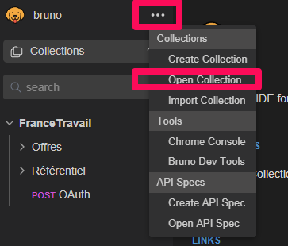
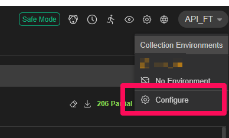
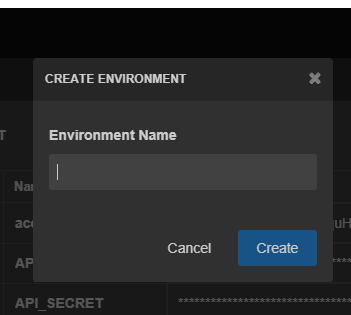
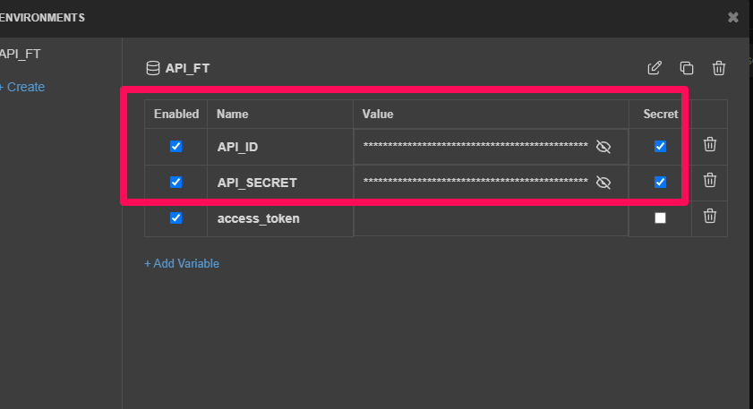
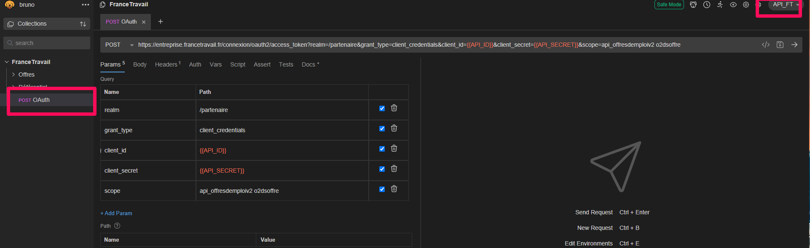
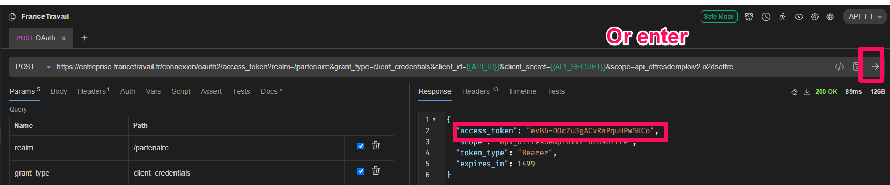
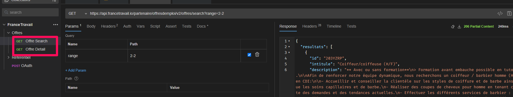

# Consume France Travail API with Bruno 
******

 1. Donwload Bruno : https://www.usebruno.com/
 ***
 2. Open "France Travail" collection : select folder `/exploration/api/francetravail`

***
3. Set a collection environment (and select it) 

***
4. Define 3 variables :
* `API_ID` (your France Travail API ID)
* `API_SECRET` (your France Travail API Secret )
* `ACCESS_TOKEN` (leave blank)

***
5. Call the OAuth endpoint to generate the access-token

***
7. Then copy the value un the respons in the environment settings (`ACCESS_TOKEN` field)
***
8. Now you can use France Travail endpoints

***

**All secrets (passwords, API keys) are managed via environment configuration and excluded from version control.**